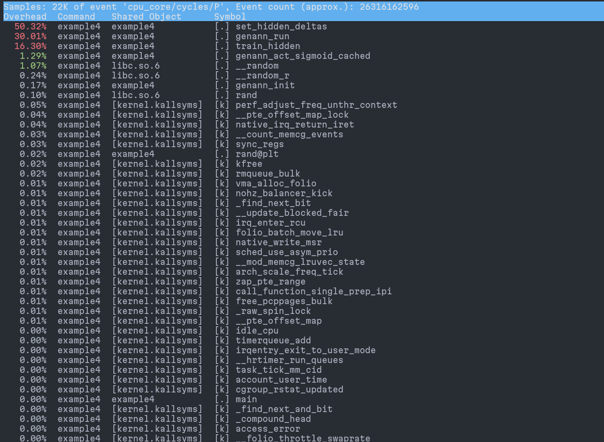
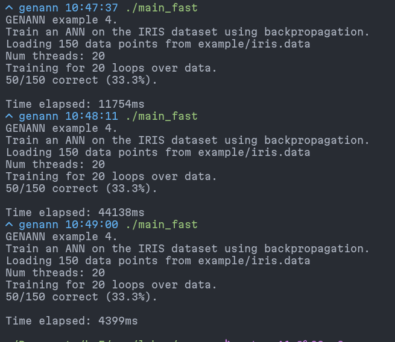
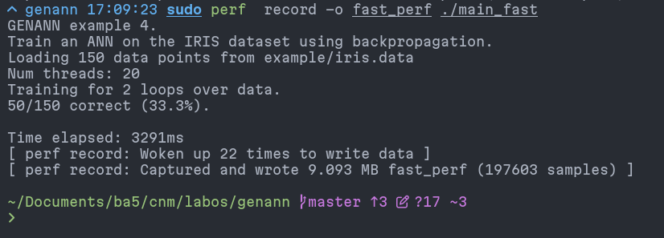
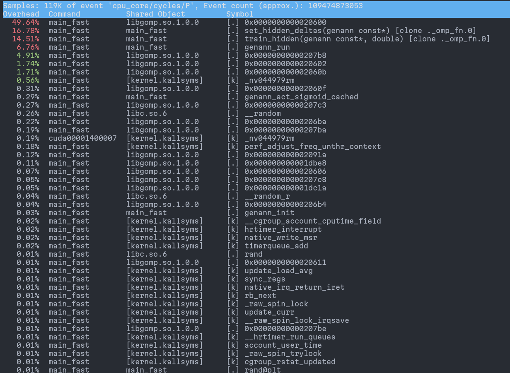

# Lab05 - Acceleration of an AI application

## Stage 1 – Choosing an application

We have chosen the *genann* library. It is a small C library for creating and training neural networks. It provides basic functionalities for forward propagation, backward propagation, and weight updates.

It should be noted that we spent a lot of time looking for an application that was not written in Python, did not result in too many errors during compilation, and was not too hard to understand.

### Modifications

In order to properly test our accelerations, we modified the example 4, which
is an executable which was present in the original code. This app trains a network
on the iris dataset, and then runs the model.

We decided to add some hidden layers and neurons in order to make the speedup
more significant, otherwise the default was 1 hidden layer with 4 neurons.
We increased this to 50 layers of 400 neurons, and reduced the amount of iterations
in order to make the run time quicker.

This completely broke the efficiency of the network, but this is not what we
are interested in for this lab.

In addition to what is described above, we switched the language from C to C++
because we had trouble compiling the CUDA code. Finally, we added a timer
to measure the training time.

## Stage 2 – Analysing application bottlenecks

> What is the execution time of the application?

The original application's run time is about 5.5 seconds.

> What is the complexity of the application (constant O(1), linear O(n), other?)?

The complexity of the neural network training is approximately O(n × m × l), where n is the number of neurons per layer, m is the number of input samples and l is the number of training epochs.

> What are the bottlenecks?

After running the `perf` tool, we noticed that we had bottlenecks in
the training part of the application, more specifically the two functions
`set_hidden_deltas` (almost half of the samples) and `train_hidden`.

The `genann_run` is also quite heavy, but we will focus on speeding up the
training in this lab.

> Which parts of the application do you plan to accelerate and why?

We plan to accelerate for loops used in training, provided there are no data dependencies. For example, we can not parallelize weight updates because these calculations must be done in the right order.

> What is theoretically the performance that you could and would like to achieve?

The whole application can not be parallelized, and the parallelizable parts consist
of only about half of the execution time. On this percentage of execution time,
we can theoretically hope to achieve a speed-up corresponding to the amount of threads on the machine.

In practice, the speed-up rate depends on many factors including thread affinity.

## Stage 3 – Acceleration

> How do you plan to accelerate different parts of your application?

We will use CUDA for a part of the `genann_init()` function and OpenMP for a part of the `train_hidden()` and `set_hidden_deltas` functions.

The `genann_init` is not really a bottleneck, but it was a good candidate for CUDA
acceleration. We did this mainly for the exercice than anything, as we did not
find some more performance critical parts that could be improved with CUDA.

> Which libraries are you going to use for GPU acceleration?

We will not use any library for GPU acceleration because we only use GPU for initalizing an array.

> Analyse the memory needs of your application before starting.

> How big is the data?

The data used inside the accelerated sections is relatively small, but this
depends on the size of the network.

> Where is it?

This data is stored in RAM and is heap allocated.

> What is the expected data locality?

We expect a high data locality considering the whole network is allocated at once
with malloc.

### Description of work provided

To accelerate the neural network training, we first added OpenMP parallel for loops
in the `set_hidden_deltas` and `train_hidden`.

These were not very straighforward to write because we could not blindly parallelize
the external loops over the hidden layers. Instead, we had to take into account
that layers depended on previously computed layers which means that we
had to parallelize the loops over neurons instead. This implied to properly
calculate the pointer offsets for each thread / each iteration.

In addition to this, we added a CUDA accelerated version of the `genann_init_sigmoid_lookup`
function even though this function is only called once per neural network.
Since this function is only a pretty simple loop, the CUDA kernel was quite easy
to write.

## Stage 4 – Analysis of results

> What is the performance enhancement achieved?

Unfortunately, the run time of the application seems to be extremely inconsistent
for some reason:

Despite these inconsistencies, we could observe a speedup during some runs
as shown below. The run time was about 3.2 seconds, which represents a speedup
of 5.5 / 3.2 = 1.7x.
This is quite a bit lower than the (very generous) estimation we did above.

> Where does it come from and why?

The acceleration mostly comes from the loops parallelized with OpenMP. Regarding
the CUDA part, the overhead of using the GPU probably negates the potential
speedup that could be achieved.

> What is the new bottleneck created?

When using the GPU, a certain amount of time is needed to transfer data between the CPU and the GPU, and there are still unparallelized portions due to data dependency.

Using the perf profiling tool, we were able to measure the amount of CPU cycles
spend in each functions. This does not show an improvement with the use of OpenMP
because the speedup comes from the parallelization, which also introduces more instructions.
This means that the bottlenecks are looking even worse with this analysis.

Finally, we could mention that the running of the network is still taking a significant
portion of the execution time.

> Seeing the acceleration results, what other things should you accelerate?

As mentionned above, the running of the network could still be accelerated but there are no really other parts
that could be significantly improved without making major changes to the code.

One idea would be to use the cuDNN CUDA lbirary in order to have access to
already accelerated primitives.

> Now that you see the results, should you have done something different?

We would probably have chosen another application because this one does not seem to fit
this lab very well (even though it already took us a very long time to pick).
