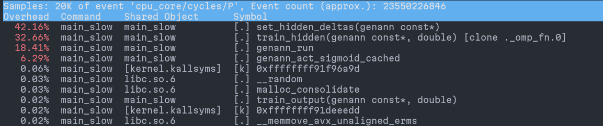

# Lab05 - Acceleration of an AI application

## Stage 1 – Choosing an application

We have chosen the *genann* library. It is a small C library for creating and training neural networks. It provides basic functionalities for forward propagation, backward propagation, and weight updates.

It should be noted that we spent a lot of time looking for an application that was not written in Python, did not result in too many errors during compilation, and was not too hard to understand.

## Stage 2 – Analysing application bottlenecks

> What is the execution time of the application?

TODO

> What is the complexity of the application (constant O(1), linear O(n), other?)?

The complexity of the neural network training is approximately O(n × m × l), where n is the number of neurons per layer, m is the number of input samples and l is the number of training epochs.

> What are the bottlenecks?

After running the `perf` tool, we noticed that we had bottlenecks in
the training part of the application, more specifically the two functions
`set_hidden_deltas` (almost half of the samples) and `train_hidden`.

The `genann_run` is also quite heavy, but we will focus on speeding up the
training in this lab.

> Which parts of the application do you plan to accelerate and why?

We plan to accelerate for loops used in training, provided there are no data dependencies. For example, we can not parallelize weight updates because these calculations must be done in the right order.

> What is theoretically the performance that you could and would like to achieve?

TODO : améliorer et compléter

The whole application can not be parallelized, and the parallelizable parts consist of only TODO % of the execution time. On this percentage of execution time, we can hope to achieve a speed-up of TODO %. The speed-up rate depends on TODO.

## Stage 3 – Acceleration

> How do you plan to accelerate different parts of your application?

We will use CUDA for a part of the `genann_init()` function and OpenMP for a part of the `train_hidden()` function.

> Which libraries are you going to use for GPU acceleration?

We will not use any library for GPU acceleration because we only use GPU for initalizing an array.

> Analyse the memory needs of your application before starting.

> How big is the data?

TODO

> Where is it?

TODO

> What is the expected data locality?

TODO

> TODO : description of work provided -> 2 dossiers separes pour app de base et app acceleree

## Stage 4 – Analysis of results

> What is the performance enhancement achieved?

TODO

> Where does it come from and why?

TODO

> What is the new bottleneck created?

TODO : compléter

When using the GPU, a certain amount of time is needed to transfer data between the CPU and the GPU, and there are still unparallelized portions due to data dependency.

> Seeing the acceleration results, what other things should you accelerate?

TODO

> Now that you see the results, should you have done something different?

TODO
